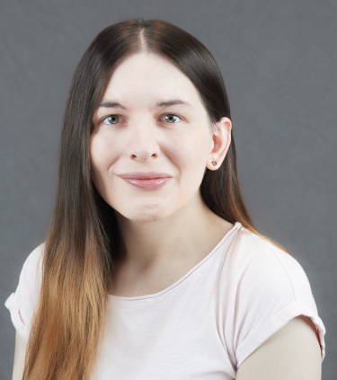
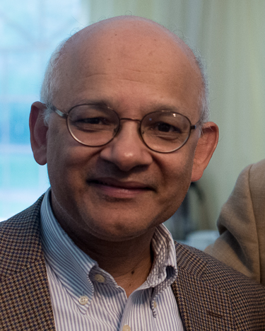

# Invited Talks

## Hannah Earley

### Bio

{: .invited-talk}

[Hannah Earley](https://ha.nnah.io/) is the co-founder and Chief Technology Officer of [Vaire Computing](https://vaire.co/), where she leads the development of reversible computing architectures for ultra-low-energy AI workloads.
Vaire's approach aims to overcome the energy limits of conventional silicon by leveraging resonant logic and adiabatic switching, moving computation closer to thermodynamic efficiency.

Hannah holds a PhD in Applied Mathematics and Theoretical Physics from the University of Cambridge, where she focused on the mathematical foundations of computation and physics-informed models of logic.

### Reversing the history of computing

> It is 90 years on from Church and Turing's first publications, changing the world as we know it. Unfortunately, gaps in our knowledge of physics, thermodynamics, and information have baked in inefficiencies alongside these innovations. We are now suffering the consequences. But how can we extirpate them, sustainably and one step at a time, without overhauling the entirety of our technological infrastructure at once? What can we keep? What must we change? What future will this enable? And why now?

## Prakash Panangaden

### Bio

{: .invited-talk}

[Prakash Panangaden](https://www.cs.mcgill.ca/~prakash/) graduated from the University of Wisconsin–Milwaukee, and has been a professor at Cornell University, Queen's University, McGill University and  University of Edinburgh, where he is now an Emeritus professor.
His research has always been at the crossing of computer science, mathematics and physics, and his earliest contribution to quantum causality and dynamics dates from 2003.
He has also contributed significantly to programming languages, probabilistic systems, and relativity study.
Among the many awards and prizes he received stands [the LICS Test of Time Award](https://lics.siglog.org/archive/test-of-time-award.html), awarded *twice* (in 2017 and 2022).

### Quantum Alternation

> The by now standard paradigm for imperative quantum programming languages is based on Selinger's slogan of quantum data and classical control.  Crucially conditionals are based on testing Booleans, i.e. classical bits.  There have been suggestions that we should "move on" to quantum control constructs where the conditional is based on qubits.  My former student Costin Badescu and I showed that these are problematic: there is no semantics based on the traditional superoperators, the constructs are non-compositional and non-monotone.  In this talk I will give an account of these problems and what we can do about it.
