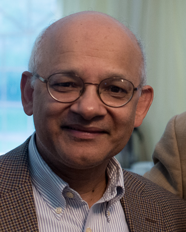

# Invited Talks

## Prakash Panangaden

### Bio

{: style="float: left; margin-right: 1em; width: 150px"}
[Prakash Panangaden](https://www.cs.mcgill.ca/~prakash/) graduated from the University of Wisconsin–Milwaukee, and has been a professor at Cornell University, Queen's University and McGill University, where he is now an Emeritus professor.
His research has always been at the crossing of computer science, mathematics and physics, and his earliest contribution to quantum causality and dynamics dates from 2003.
He has also contributed significantly to programming languages, probabilistic systems, and relativity study.
Among the many awards and prizes he received stands [the LICS Test of Time Award](https://lics.siglog.org/archive/test-of-time-award.html), awarded *twice* (in 2017 and 2022).

### Abstract -- Why are quantum conditionals problematic?

*Abstract to come*

